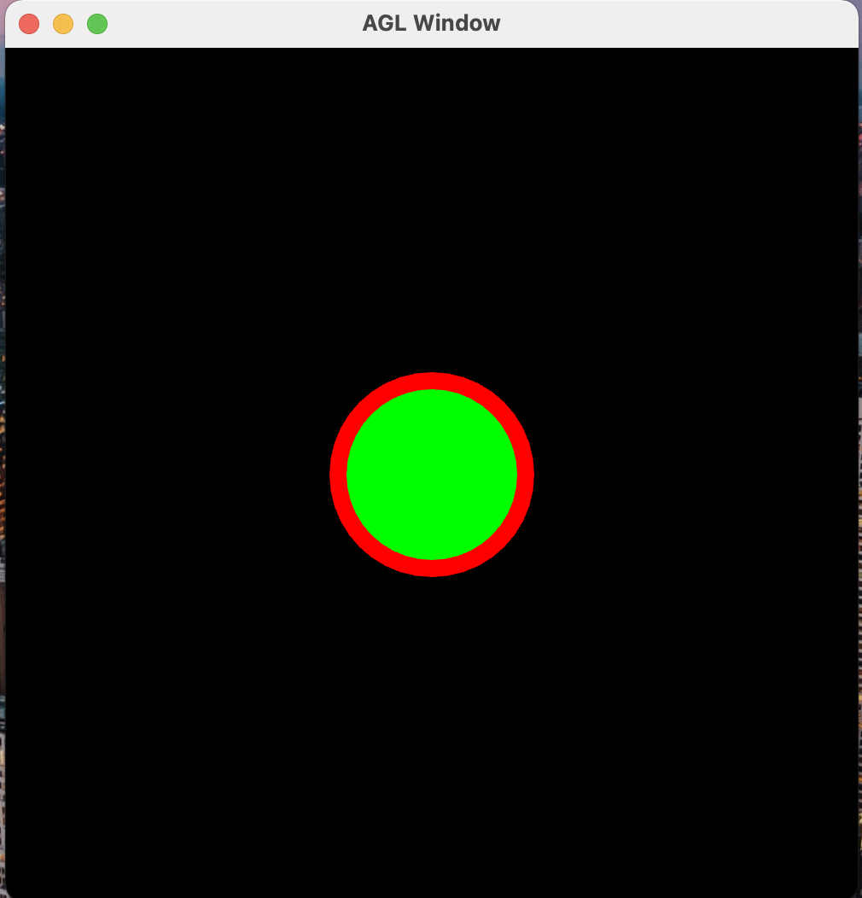

# Readme

## Sphere2D

The image shows a red sphere behind a green sphere.

## Sphere3D

This gif shows that the sphere first moved around randomly, switched
directions a few times, and then moved back to the origin. This is because:

- when we press the space bar, the sphere move into a random direction.

- when we press R, the sphere repositioned back to the origin and stopped 
moving around.

- In the gif, I pressed the space bar multiple time, and R once at the end.
