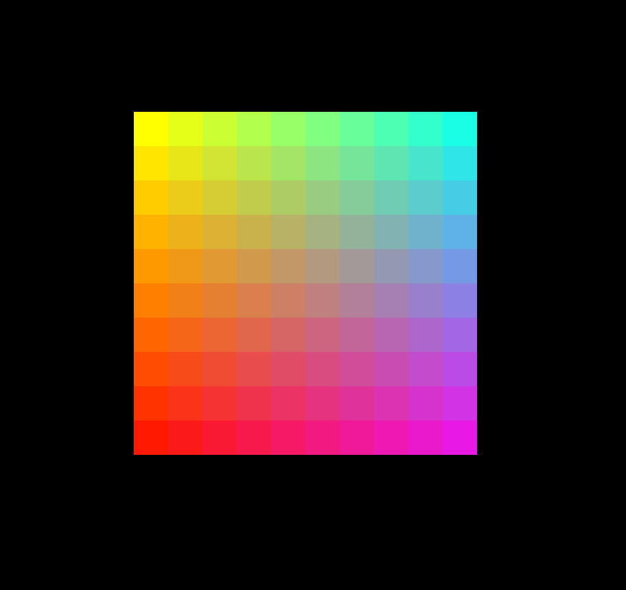

# Readme

TODO: Replace this text with

* images, gifs, videos
* brief description of what each image/gif/video shows

## Gradient

A grid of nice gradient color.

## Draw Curve

Draw the curve with Bernstein when we press 1, and Casteljau when we
press 2.

## Particle Curve

A sphere that moves along a curve and wraps around.

## Screen Saver

Screen saver animation with a trailing effect

## Unique: Fireworks!

Click to generate fireworks!

